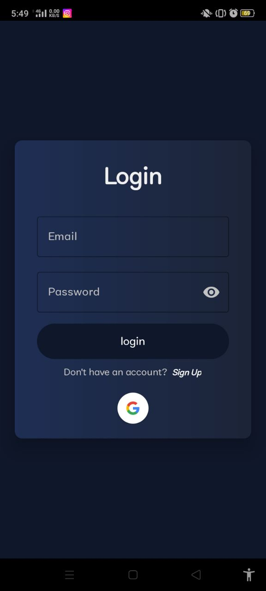
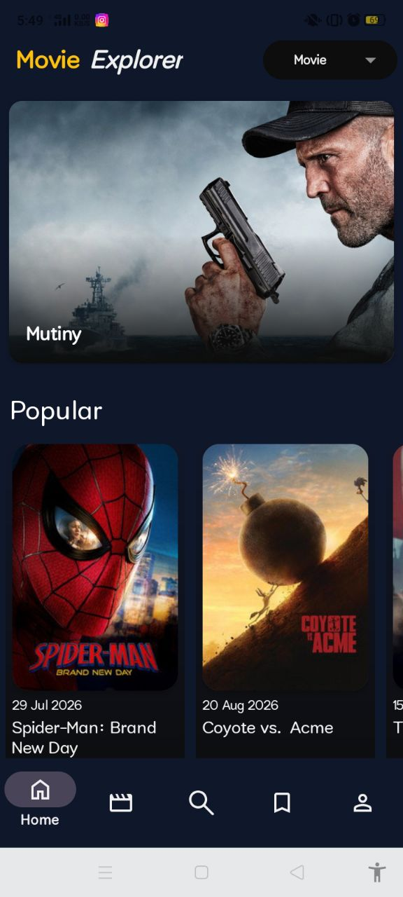
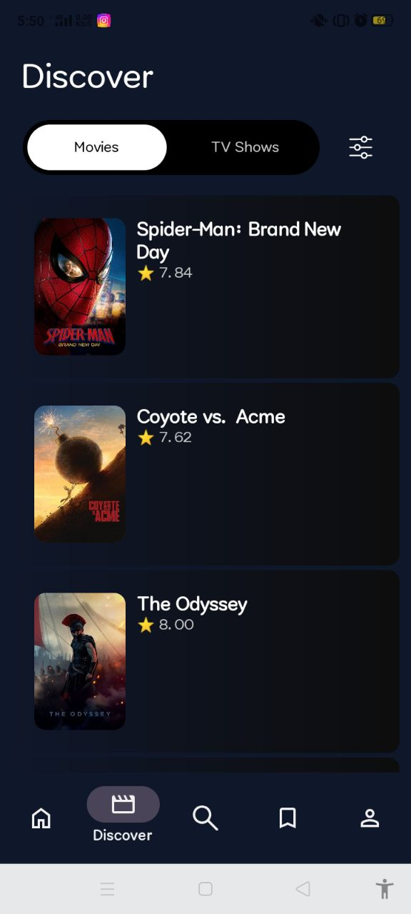
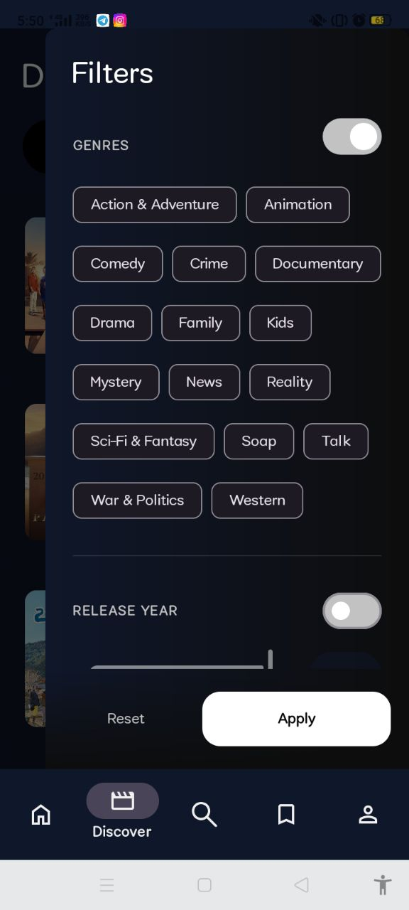
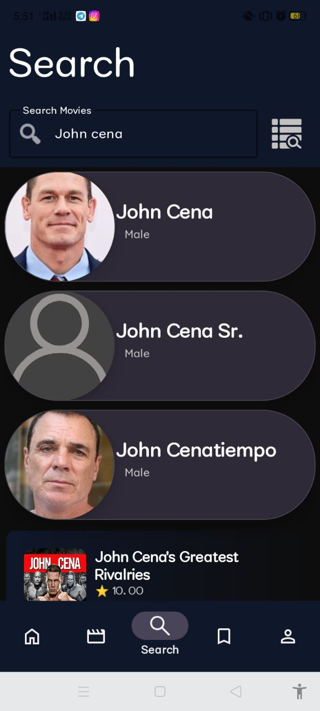
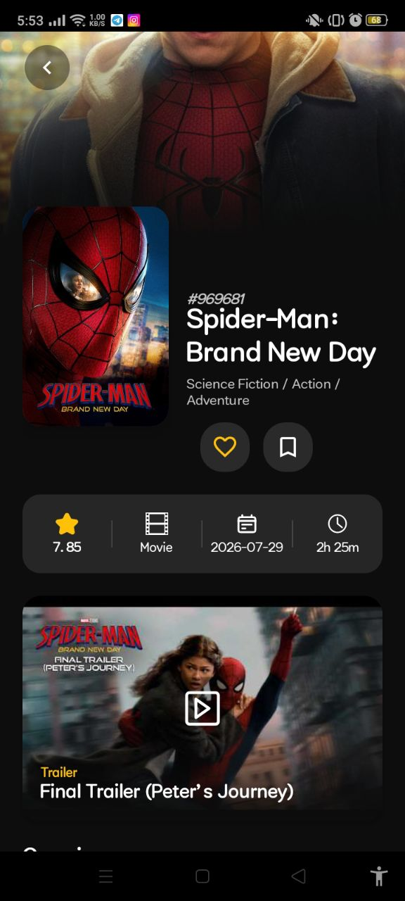
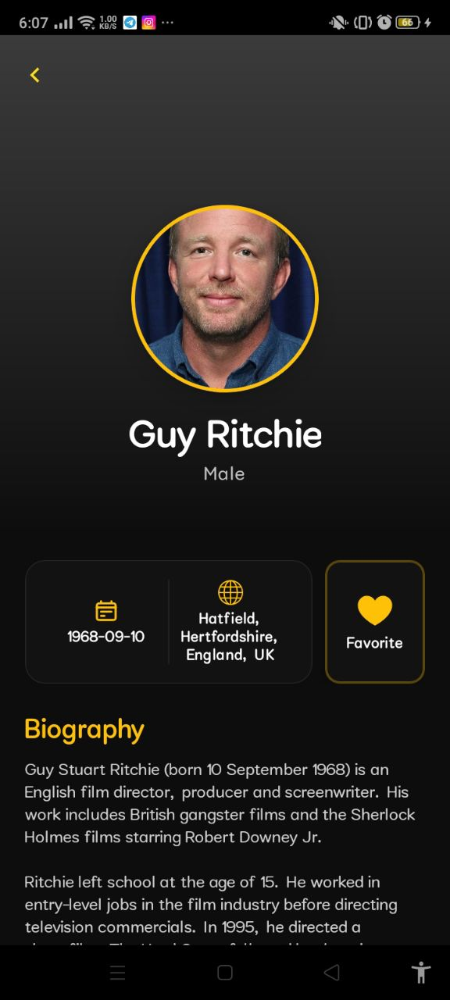
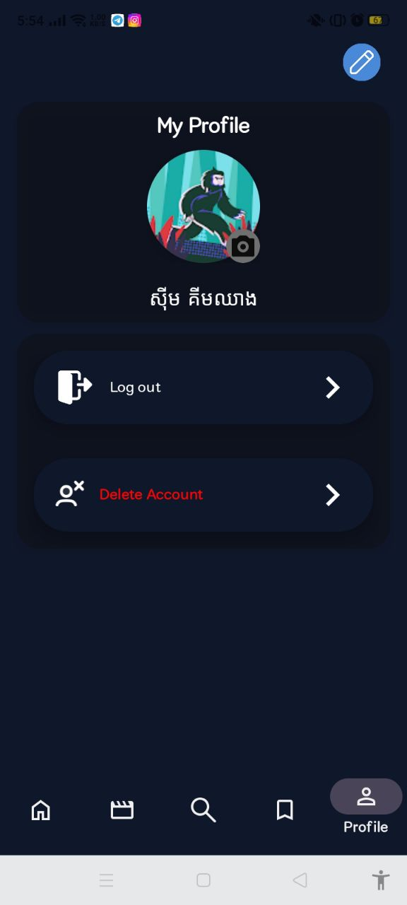

# MovieExplorer

An Android movie and TV show discovery application built with Java and the TMDB API.

## 📱 Demo

[▶ Watch Preview Video](https://youtu.be/ENuBsbjy2HU)

[⬇ Download APK](https://github.com/teumeng008/MovieExplorer/releases/tag/v1.0.0)

## Features

* Browse movies and TV shows
* Search movies, TV shows, and people
* Movie and TV show details
* Cast and crew information
* Favorites
* Watchlist
* Favorite people
* Firebase authentication
* Genre, rating, and year filtering
* Google Sign-In

## Technologies

* Java
* Android Studio
* MVVM
* Retrofit & OkHttp
* TMDB API
* Firebase Authentication
* Cloud Firestore
* Cloudinary (image storage)
* Picasso
* Material Components
* RecyclerView
* ViewPager2 & TabLayout
* Shimmer Loading

## Screenshots

  
  
  
  

  
  
  
  

## Architecture

MovieExplorer uses an **MVVM-oriented architecture**.

* **Activities & Fragments** handle the UI and user interactions.
* **ViewModels** manage UI state, filtering, and data processing for refactored features.
* **Retrofit & MovieApi** handle communication with the TMDB API.
* **Firebase Authentication & Firestore** handle authentication and user data.
* **Cloudinary** is used for storing user-uploaded images.

## Installation

1. Download the APK.
2. Install it on an Android device.
3. Open MovieExplorer.
